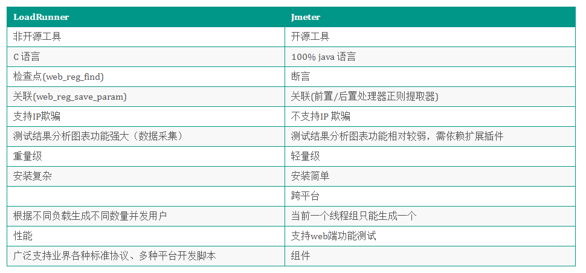

# Jason Test Notes

## python

### 数据类型

> ##### 字符串

1. 格式化

   ```
   age =20
   name ="zangsan";
   print('Happy %d birthday %s!'%(age, name))
   print('Happy {} birthday {}'.format(age,name))
   print(f'Happy {age} birthday{name}')  #拼接 最常用
   #print("hello"+name+"age"+age) 不支持这种写法
   ```

2. 判断是否以xx开头

   ```
   v1 = "中国上海移动"
   
   # True/False
   result = v1.startswith("中国")
   ```

3. 判断是否以xx结尾

   ```
   v1 = "中国上海移动"
   
   # True/False
   result = v1.endswith("移动")
   ```

4. 判断是否是数字

   ```
   str = "123456"  # 字符串只包含数字
   print (str.isdigit())
    
   str = "this is string example....wow!!!"
   print (str.isdigit())
    
   str = "0"
   print (str.isdigit())
    
   str = "-1"
   print (str.isdigit())
   ```

5. 大小写

   ```
   msg = "Root"
   data = msg.upper() # ROOT
   data = msg.lower() # root
   
   print("data数据 {}".format(data))
   print("msg 数据 {}".format(msg))
   print(f"msg数据 {msg},data数据{data}")
   ```

6. 去除空白

   ```
   data = "中国移动 "
   data = " 中国移动"
   data = " 中国移动 "
   
   result = data.rstrip()  # 去right右边空格 
   result = data.lstrip()  # 去left空格"
   result = data.strip()  # "前后空格"
   
   #对原来变量没有影响
   ```

7. 切割

   ```
   line = "199999999,12312,mtx"
   
   data = line.split(",")  # ["199999999","12312","mtx"]
   print(data)
   ```

8. 替换

   ```
   data = "中国上海移动"
   result = data.replace("上海","**")
   print(f"data ={data},result={result}")
   ```

9. 拼接

   ```
   data_list = ['199999999', '12312', 'mtx']
   
   result = ",".join(data_list)
   print(result) # 199999999,12312,mtx
   ```

10. 字符串和字节

    ```
    data = "中国移动A"     # 字符串
    
    result = data.encode("utf-8")  # 字节
    
    new_data = result.decode("utf-8") # "中国移动A"
    ```

11. 切片

    ```
    name = "testfan"
    print(name[2:5]) # 2到5字符串 stf
    print(name[:5]) # 不写起始，则认为是从0始 testf
    
    #负数是从右到左 定位坐标，取值还是从左到右
    print(name[-5:-1]) # 倒叙截取，从-5个字符(重点) stfa
    print(name[-5:])   #stfan
    print(name[:-1]) #testfa
    
    #第三位是步长，缺省时候是1  
    #在step>0时，参数1一定小于参数2（左边的下标一定小于右边）数据从右到左；
    #而在step<0时，参数1一定大于参数2 数据从左到右
    print(name[2:5:1]) # 下标2到5，步长是1 
    print(name[2:5:2]) # 步长为2就后面元素的索引 步长 sf
    print(name[-2:-5:-1]) # 步长为-1 切片
    print(name[::-1]) #数据反转
    ```

> ##### 列表

1. 追加

   ```
   data = [1, 2, 3, "root","北京",True]
   data.append("上海")
   print(data) # [1, 2, 3, "root","北京",True,"上海"]
   ```

2. 插入

   ```
   data = [1, 2, 3, "root","北京",True]
   data.insert(0,"上海")
   ```

   ```
   data = [1, 2, 3, "root","北京",True]
   # data.insert(0,"上海")
   data.insert(2,"上海")
   print(data)
   ```

3. 删除

   ```
   data_list = ['刁民', 'eric', '极光', 'eric']
   data_list.remove("eric")
   print(data_list)
   # 想要删除的前提是，他一定在列表中存在。
   ```

   ```
   data_list = ['eric', 'zhangsan', '李四', 'mtx', '王五']
   
   # True/False
   if "eric" in data_list:
       data_list.remove("eric")
   
   print(data_list)
   ```

4. 清空列表

   ```
   data_list = ['极光', 'zhangsan', '李四', 'mtx', '王五']
   
   data_list.clear()
   print(data_list)
   ```

5. 排序

   ```
   data_list = [100, 11, 88, 22, 33, 44, 55]
   data_list.sort() # 从小到大
   print(data_list)
   ```

   ```
   data_list = [100, 11, 88, 22, 33, 44, 55]
   data_list.sort(reverse=True)  # 从大到小
   print(data_list)
   ```

6. 翻转

   ```
   data_list = ['极光', 'zhangsan', '李四', 'mtx', '王五']
   data_list.reverse()
   print(data_list)
   ```

7. 数组转字符串

   ```
   data_list = ['极光', 'zhangsan', '李四', 'mtx', '王五']
   
   result = ";".join(data_list)
   print(result) # 极光;zhangsan;李四;mtx;王五
   ```

> ##### 集合、元祖

```
data1 = [11,22,33,44,44]  # 列表
data2 = {11,22,33,44,44}  # set
data3 = (11,22,33,44,44)  # 元组
```

> ##### 字典

1. 获取值

   ```
   info = {
       "age":18,
       "status":True,
       "name":"极光"
   }
   
   # 根据键获取对应的值
   v1 = info.get("name")
   print(v1) # "极光"
   
   
   v2 = info["age"]
   print(v1) # "极光"
   
   # 根据键获取对应的值
   v1 = info.get("test")
   print(v1) # None
   
   # 根据键获取对应的值
   v1 = info.get("xxxxx",666)
   print(v1) # 666
   ```

2. 键/值/键值对

   ```
   info = {
       "age":18,
       "status":True,
       "name":"极光"
   }
   
   data = info.keys()    # ["age","status","name"]
   data = info.values()  # [18,True,"极光"]
   data = info.items()   # [('age', 18), ('status', True), ('name', '极光')])
   ```

   ```
   for item in info.keys():
   	print(item)
   	
   for item in info.values():
   	print(item)
   	
   for item in info.items():
   	print(item[0],item[1])
   	
   for k,v in info.items():
   	print(k,v)
   ```

### python函数

> ##### 邮件发送

```
import smtplib
from email.mime.text import MIMEText
from email.utils import formataddr


def send_email(title, to):
    # 1.构建邮件内容
    msg = MIMEText(title, "html", "utf-8")  # 内容
    msg["From"] = formataddr(["jasonTest", "15057178850@163.com"])  # 自己名字/自己邮箱
    msg['to'] = to  # 目标邮箱
    msg['Subject'] = "邮件测试"  # 主题

    # 2.发送邮件
    server = smtplib.SMTP_SSL("smtp.163.com")
    server.login("15057178850@163.com", "QDEUDZUGEKQKGOCI")  # 账户/授权码
    server.sendmail("15057178850@163.com", "370546074@qq.com", msg.as_string())  # 自己邮箱/目标邮箱/内容
    server.quit()


send_email("邮件测试1", "370546074@qq.com")
```

> ##### 函数参数总结

1. 普通参数

   ```
   def do_something(a1,a2):
       print(f"type_a {type(a1)}, type_a2 {type(a2)} a1={a1}, a2={a2}");
   
   do_something(11,22)        #普通传参
   do_something(a1=33,a2=11)  #直接给参数赋值
   do_something("zhangsan","李四")  #字符串类型
   do_something("zhangsan",{"abc","abc"})  #set类型
   do_something("zhangsan",["abc","abc"])  #list集合
   ```

2. 默认参数

   ```
   def do_something(a1,a2=10):
       print(f"type_a {type(a1)}, type_a2 {type(a2)} a1={a1}, a2={a2}");
   
   do_something(11,22)        #普通传参
   do_something(a1=33,a2=11)  #参数赋值
   do_something(11)  #多一种支持
   do_something("zhangsan","李四")  #任型类型
   do_something("zhangsan",{"abc","abc"})  #任型类型
   do_something("zhangsan",["abc","abc"])  #任型类型
   
   #注意：定义时，有默认值的参数必须放在最后。
   ```

3. 动态参数

   ```
   def do_something(a1,*args):
        print(f"type_a {type(a1)}, type_args {type(args)} a1={a1}, a2={args}")   
   do_something(1)
   do_something(1,11)
   do_something(9,11,123123)
   do_something(9,["abc","abc"])
   
   #总结 默认参数不改变传入参数类型，可变参数转换成元组
   do_something(9,("abc","abc"))  #如果是元组
   ```

   ```
   def do_something(a1,**kwargs):
         print(f"type_a {type(a1)}, kwargs {type(kwargs)} a1={a1}, kwargs={kwargs}")
   
   do_something(1)
   do_something(1,2) #出错
   do_something(2,x=2) #正确  区别 do_something(a1=2,x=2)
   do_something(1,v1=1,x=11)
   
   **kwargs 关键词参数会转换成字典dict类型
   
   特殊例子
   info = {
       "age":18,
       "status":True,
       "name":"极光"
   }
   print(type(info))
   do_something(1,info) #对错？
   
   
   do_something(1,("abc","abc")) 也不支持
   ```

4. 

## 性能

### locust

> ##### 比较loadrunner和jmeter



> ##### locust定义

Locust是一款易于使用的分布式负载测试工具，完全基于事件，即一个locust节点也可以在一个进程中支持数千并发用户，不使用回调，通过[gevent](http://www.gevent.org/)使用轻量级过程（即在自己的进程内运行）。 

> ##### locust的优点

- 基于协程 ,低成本实现更多并发
- 脚本增强（“测试即代码”）
- 使用了requests发送http请求
- 支持分布式
- 使用Flask 提供WebUI
- 有第三方插件、 易于扩展

> ##### 官网地址

https://www.locust.io/ 

> ##### locust例子

```
from locust import HttpLocust, TaskSet, task, between

class UserBehaviour(TaskSet):
    def on_start(self):
        """ on_start is called when a Locust start before any task is scheduled """
        self.login()

    def on_stop(self):
        """ on_stop is called when the TaskSet is stopping """
        self.logout()

    def login(self):
        self.client.post("/login", {"username":"ellen_key", "password":"education"})

    def logout(self):
        self.client.post("/logout", {"username":"ellen_key", "password":"education"})

    @task(2)
    def index(self):
        self.client.get("/")

    @task(1)
    def profile(self):
        self.client.get("/profile")

class WebsiteUser(HttpLocust):
    task_set = UserBehaviour
    wait_time = between(5, 9)
```

> ##### 启动locust

$ locust -f locust_files/my_locust_file.py 

> ##### Locust类

一个Locust类代表一个用户(或者一个集群Locust)。Locust将为每个正在模拟的用户生成（孵化）一个Locust类实例。Locust类通常应该定义一些属性。

> ##### task_set属性

task_set属性应该指向一个TaskSet类，这个类定义了用户的行为，下面将对其进行更详细的描述。

> ##### wait_time属性

除了task_set属性，还应该声明一个wait_time方法。它用于确定模拟用户在执行任务之间将等待多长时间。Locust提供了一些内置的函数，返回一些常用的wait_time方法。

最常见的是between  。它用于使模拟用户在每次执行任务后等待介于最小值和最大值之间的随机时间。其他内置的等待时间函数是constant和constant_pacing。

> ##### 代码示例

```
import json
import os

from locust import HttpUser, constant, between, task, TaskSet, SequentialTaskSet


class Login(HttpUser):
    host = 'http://xnrh-test.zjcdjk.cn'  # 可选
    # port = 8087  # 可选默认 8089
    wait_time = constant(3)  # 每次请求停顿时间 （思考时间）

    # wait_time = between(1, 3)
    @task
    def login(self):
        url = '/xnrh-yhzx/api/user/login'
        data = {
            "clientId": "1000001",
            "password": "a48146e05674b51b6d56a415f56ca0aa",
            "username": "15057178850"
        }
        headers = {
            'Content-Type': 'application/json'
        }
        with self.client.post(url=url, data=json.dumps(data), timeout=5, name='效能系统登录测试', catch_response=True, headers=headers) as response:
            if (response.json()['success'] == True):
                response.success()
            else:
                response.failure(response.json())


if __name__ == '__main__':
    os.system('locust -f locustfile.py')
```


## 问题记录

### locust启动web-ui页面出不来


### centos安装mysql

https://blog.csdn.net/weixin_42218986/article/details/125893503

### 云服务器上压测和本地服务器压测的区别

1. 资源弹性和可伸缩性：云服务器具有资源弹性和可伸缩性的特点。您可以根据需要快速调整云服务器的规模，增加或减少计算能力、存储空间和网络带宽等资源。这使得在云上进行压测更加灵活和高效。而本地服务器的资源是有限的，调整资源规模相对较为复杂和耗时。
2. 成本效益：使用云服务器进行压测可以根据实际需求按需付费。您只需支付实际使用的资源和服务，而无需购买昂贵的硬件设备和进行长期维护。相比之下，本地服务器需要承担更高的成本，包括硬件采购、设施维护、人员管理等费用。
3. 网络环境：云服务器通常位于数据中心，具有高速、稳定的网络连接。这可以确保在压测过程中具有良好的网络性能和延迟。而本地服务器的网络性能可能受限于物理位置和网络基础设施，如网络带宽、路由器等。
4. 管理和监控：云服务提供商通常提供了一系列的管理和监控工具，用于跟踪服务器的性能指标、日志记录和报警等。这些工具使得在云上进行压测更加方便和可控。本地服务器需要自行配置和管理这些工具，相对繁琐。
5. 部署和配置：在云服务器上进行压测时，您可以快速创建、配置和部署测试环境，并根据需求进行灵活的调整。而本地服务器的部署和配置过程可能需要更多的时间和精力。

综上所述，云服务器上的压测相比本地服务器具有更高的灵活性、可伸缩性和成本效益。同时，云服务器还提供了更好的网络环境和管理工具，使得压测过程更加高效和可控。

### 字符串和json格式转化

1. 字符串转JSON：使用 `json.loads()` 方法将字符串转换为 JSON 对象。
2. JSON转字符串：使用 `json.dumps()` 方法将 JSON 对象转换为字符串。

